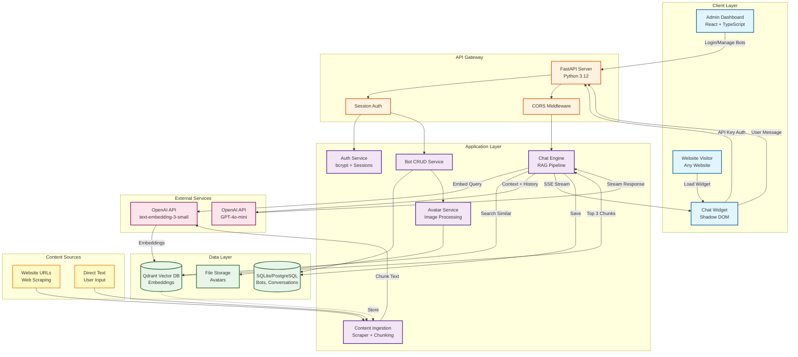

# Chirp AI Chatbot 🤖

Open-source, self-hostable AI chatbot widget with RAG (Retrieval-Augmented Generation). Train your bot on your content and embed it on any website.


---

## ✨ Features

- 🤖 **AI-Powered Chat**: Uses OpenAI GPT-4o-mini for intelligent, context-aware conversations
- 🔍 **RAG Support**: Retrieval-Augmented Generation with Qdrant vector database for accurate answers
- 📚 **Content Ingestion**: Train bots from website URLs or direct text input
- 🎨 **Fully Customizable**: Customize colors, position, avatar, and button text
- 🔐 **Secure**: Session-based admin authentication, API key management
- 📊 **Analytics**: Track message usage and bot performance
- 🚀 **Easy Deployment**: Docker-ready with one-command deployment
- 🌐 **Embeddable Widget**: Shadow DOM isolation, works on any website
- ⚡ **Real-time Streaming**: Server-Sent Events (SSE) for instant responses
- 📱 **Responsive**: Works perfectly on desktop and mobile devices

---

## 🚀 Quick Start

See **[docs/DEPLOYMENT.md](docs/DEPLOYMENT.md)** for full deployment guide.

### Docker (Recommended)

```bash
git clone https://github.com/yourusername/chirp-app.git
cd chirp-app
cp .env.production.example .env
# Edit .env with your API keys
docker-compose up -d
```

Access dashboard at http://localhost:8000

---

## 🏗️ System Architecture



### Key Components

**Client Layer:**
- **Admin Dashboard**: React-based UI for managing bots, training, and configuration
- **Chat Widget**: Embeddable JavaScript widget with Shadow DOM isolation

**API Gateway:**
- **FastAPI**: High-performance async Python web framework
- **Authentication**: Session-based for admin, API key for widget
- **CORS**: Configured for cross-origin widget embedding

**Application Services:**
- **Content Ingestion**: Web scraping, text chunking (~500 tokens), embedding generation
- **Chat Engine**: RAG pipeline with vector similarity search and GPT-4o-mini
- **Bot Management**: CRUD operations, avatar uploads, API key generation

**Data Storage:**
- **Relational DB**: SQLite (dev) or PostgreSQL (prod) for structured data
- **Vector DB**: Qdrant for semantic search (1536-dim embeddings)
- **File Storage**: Local filesystem for avatar images

**External APIs:**
- **OpenAI GPT-4o-mini**: Conversational AI responses
- **OpenAI Embeddings**: text-embedding-3-small for vector generation

### Data Flow

1. **Bot Training**: Admin ingests content → Scraper fetches/processes → Text chunked → Embeddings generated → Stored in Qdrant
2. **Chat Request**: User message → Embedded → Vector search (top 3 chunks) → Context + history → GPT-4o-mini → Streamed response (SSE)
3. **Widget Load**: Fetch config via API key → Render with custom styling → Connect to chat endpoint

---

## 📖 Documentation

- **[Deployment Guide](docs/DEPLOYMENT.md)** - Production deployment
- **[API Docs](http://localhost:8000/docs)** - OpenAPI/Swagger
- **[Quick Start](docs/QUICK-START.md)** - Getting started
- **[Implementation Plan](docs/IMPLEMENTATION-PLAN.md)** - Development roadmap

---

## 📝 License

MIT License - see [LICENSE](LICENSE)

